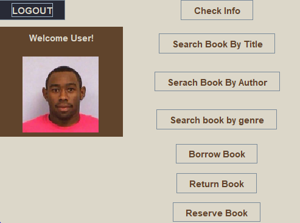

# SitNRead Library group Project

## *Get to know the project!*
The end of the semester is on its way, so are the project, and this is one of them
The students of Haigazian University who were partaking the course **Advanced Computer Programming & Data Structure** *(CSC 204)*
 
 
**Before Taking a deeper dive:** The following project was made by **two students**
 
 
**[Nazar Poladian](https://github.com/PurpleArcher2)** ||
**[Hagop Kizirian](https://github.com/JamesK24)**

## **_What did each person work on?_**

**[Nazar Poladian](https://github.com/PurpleArcher2):** Mostly focused on the UI design as well as the functionality of
the buttons / commands. In addition to the backend text folders which acted as databases.
 
 
**[Hagop Kizirian](https://github.com/JamesK24):** Concentrated on creating the main functions of both the user and the 
librarian and assisted with catching and fixing the bugs in certain places.

## **_What was utilized in the project?_**

The following application solely focuses on **Java** and in regards of the GUI, **Java Swing** was employed
in order to achieve our design.

## **_The functionality of the project_**

When it comes to the functionality and what the project does. Is the following:

### _First Things first!_
Users are welcomed to the homepage of the application where they can choose to sign in either as librarian or user.

### _Login page_
Each individual has their own unique ID. So if a certain person is the librarian they have to enter their employee ID in order to have access to 
the functionalities of the software.

### _The Section where the magic happens!_ 
#### As Librarian: 
* Add a User in the User database
* Add a Librarian in the Librarian database
* Check the info of the logged in Librarian
* Search a book by its title
* Search a book by its author
* Search a book by its genre
* Borrow Book
* Return book
* Reserve book

#### As User:
* Check the info of the logged in user
* Search a book by its title
* Search a book by its author
* Search a book by its genre
* Borrow Book
* Return book
* Reserve book

**NOTE: EACH FUNCTION HAS THEIR OWN FORM**
## _Screenshots_ 
**Welcome page!**

**User Login** 

**Librarian Login**

**User HomePage**

**Librarian HomePage**

